<h1 align="center">Hola mundo 👋, Soy Jeferson Jaimes 😃</h1>

  
  
  
  
  

<h1 align="Center"> 📳 Redes Sociales</h1>

  
  
  
  
  

<h1>Sobre mi 🧠</h1>

  
- 🎓 Estudiante de Ingeniería de Sistemas e Informática  
  
- 📚 Contenido con propósito: estudiado, compartido y pensado para ayudar
  
- 💻 Conocimientos teóricos con lo que respecta a la programación
  
- 🧠 Experiencia en desarrollo de software: reservas hoteleras y médicas, telemedicina, gestión de inventario y cotizaciones.
  
- 👨‍💻 Roles: Desarrollador, emprendedor, Arquitecto, y aún queda vida para más roles
  
- 📬 Contacto: [jaimespassunjeferson@gmail.com](mailto:jaimespassunjeferson@gmail.com)

<!--LENGUAJES DE PROGRAMACION-->

  <h1>Lenguajes de Programación</h1>
    <table>
      <tr>
        <td align="center" width ="100" >
            
           Java
        </td>
        <td align="center" width ="100" >
          
           Python
        </td>
        <td align="center" width="100">
          
         C++
      </td>
      <td align="center" width="100">
          
         PHP
      </td>
      <td align="center" width="100">
          
         MySQL
      </td>
    </table>

  <h1>🧰 Frameworks</h1>
  <table>
    <tr>
      <td align="center" width="100">
        
         Bootstrap
      </td>
    </tr>
  </table>

  <h1 align="Center" >🛠️ Herramientas y Entornos de Desarrollo</h1>
<table align="Center">
  <tr >
    <td align="center" width="100">
      
       Git
    </td>
    <td align="center" width="100">
      
       GitHub
    </td>
    <td align="center" width="100">
      
       NetBeans
    </td>
    <td align="center" width="100">
      
       VS Code
    </td>
    <td align="center" width="100">
      
       PyCharm
    </td>
    <td align="center" width="100">
      
       Cisco Packet Tracer
    </td>
    <td align="center" width="100">
      
       OpenCobolIDE
    </td>
    <td align="center" width="100">
      
       AWS
    </td>
  </tr>
</table>

<!-- 🔷 SECCIÓN DE PROYECTOS -->

  <h1 align="center">💼 Algunos Proyectos</h1>
  

  
  <!-- 🩺 PROYECTO POLICLÍNICO -->
  

    <h2 align="center">🩺 Proyecto Web: Policlínico</h2>
    
<em>Aplicación web completa para registrar médicos, pacientes, especialidades y consultorios, además de asignar horarios.</em>

   <h3>🌐 Vista pública (Página principal)</h3>
   
Incluye secciones informativas como servicios, contacto y formulario de registro de pacientes.

    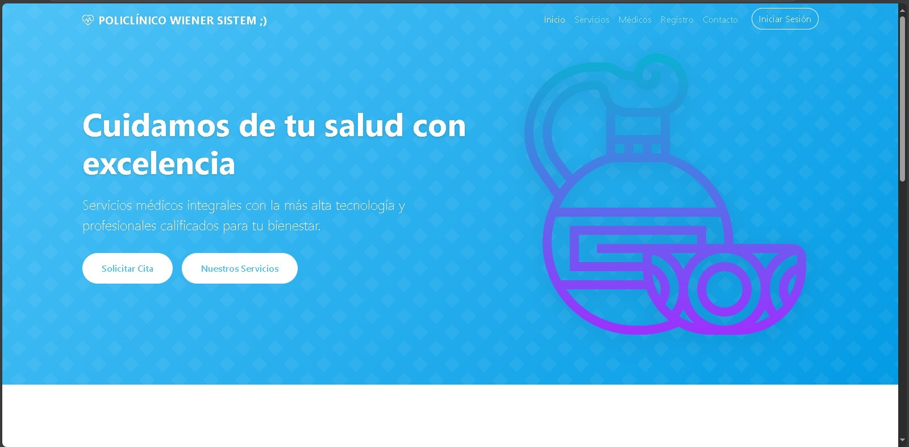
    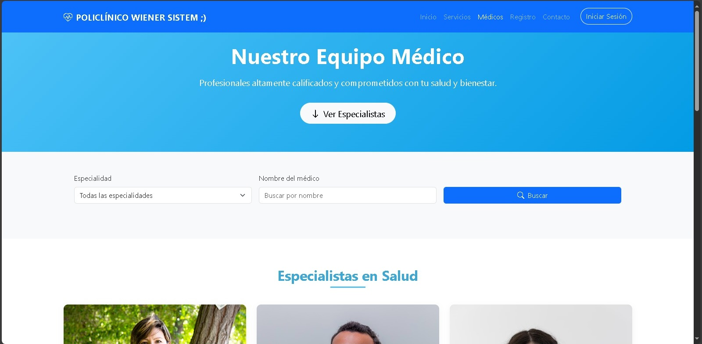
    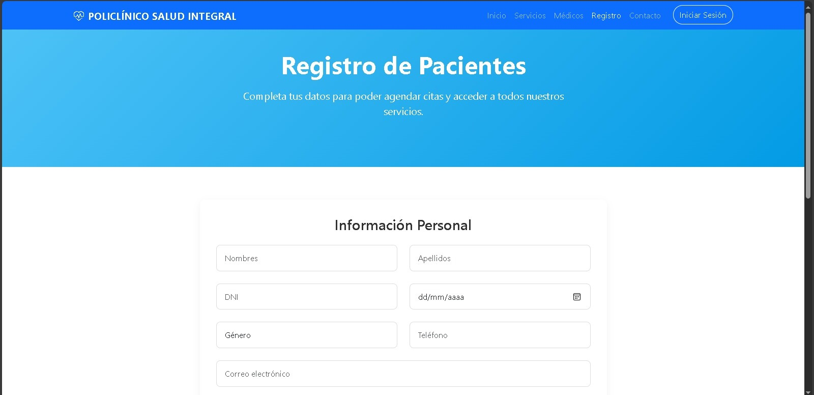
    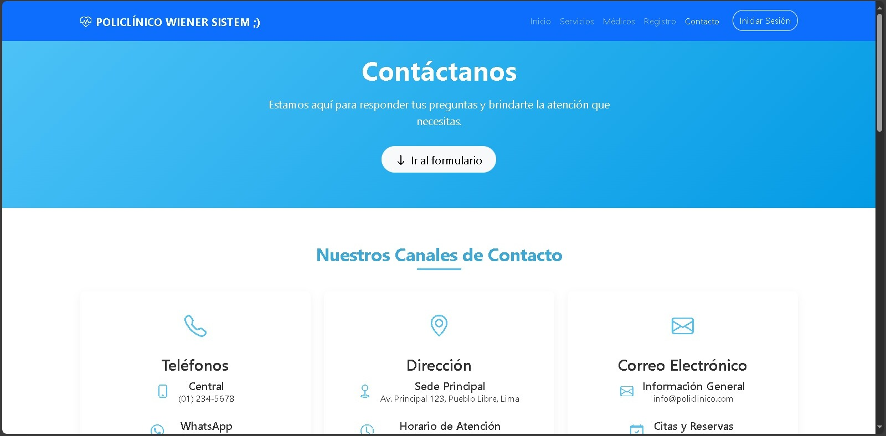

   <h3>🔐 Inicio de sesión</h3>
    
Pantalla de login exclusiva para personal administrativo del policlínico.

    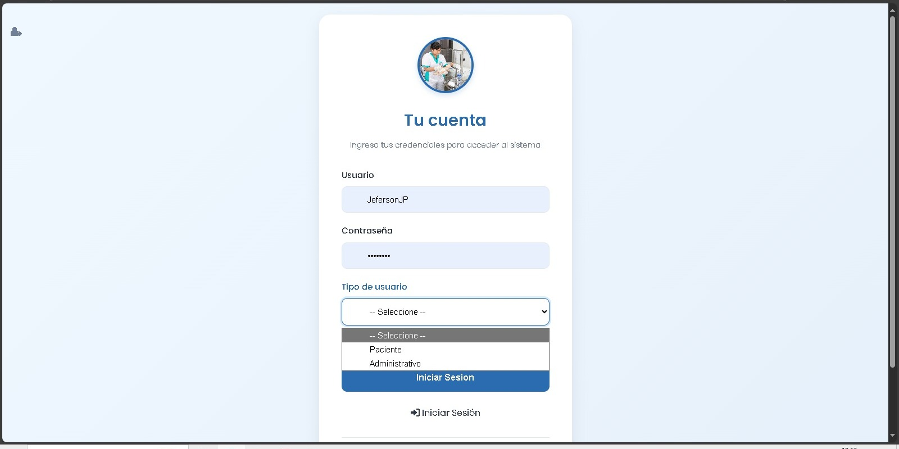

   <h3>📊 Panel administrativo (Dashboard)</h3>
    
Vista general para la gestión interna del sistema.

   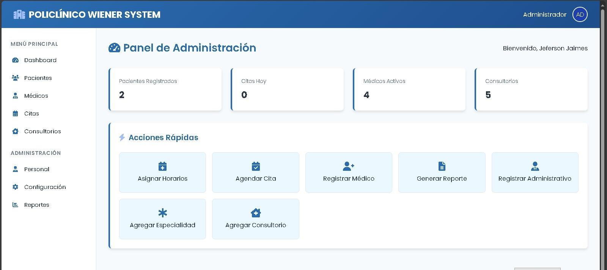

   <h3>🕐 Asignación de horarios</h3>
   
Interfaz para definir horarios de atención médica por especialidad y consultorio.

   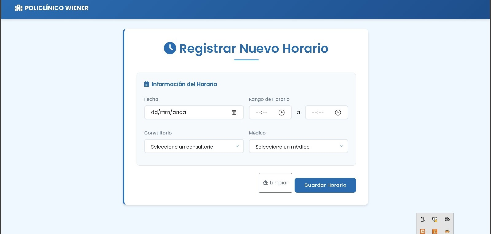
   <h3>👨‍⚕️ Registro de médicos</h3>
   
Formulario para registrar nuevos médicos con sus datos y especialidades.

   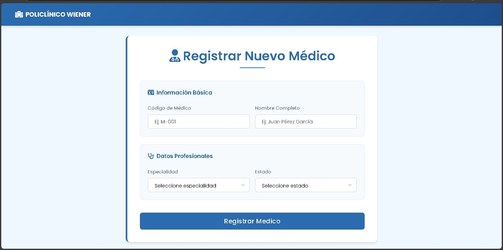

   <h3>📄 Generación de reportes</h3>
   
Funcionalidad para exportar y visualizar reportes administrativos.

   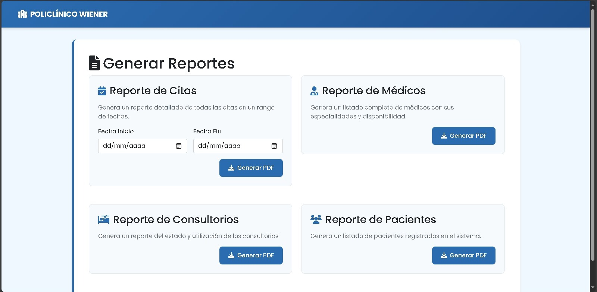

   <h3>👩‍💼 Registro de administradores</h3>
   
Permite registrar nuevos usuarios administrativos en el sistema.

   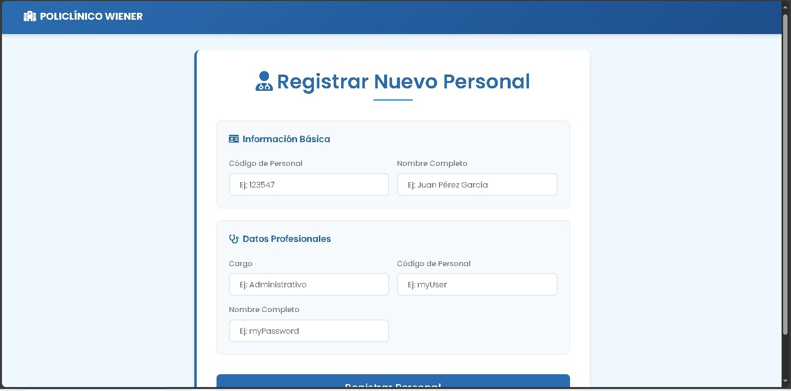

  <h3>🧬 Agregar especialidades médicas</h3>
  
Sección para administrar las especialidades ofrecidas por el policlínico.

  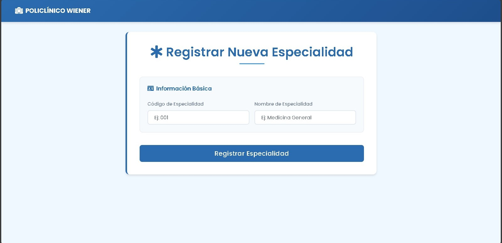
      <h3>🏥 Gestión de consultorios</h3>
  
Registro y configuración de los consultorios disponibles en el establecimiento.

  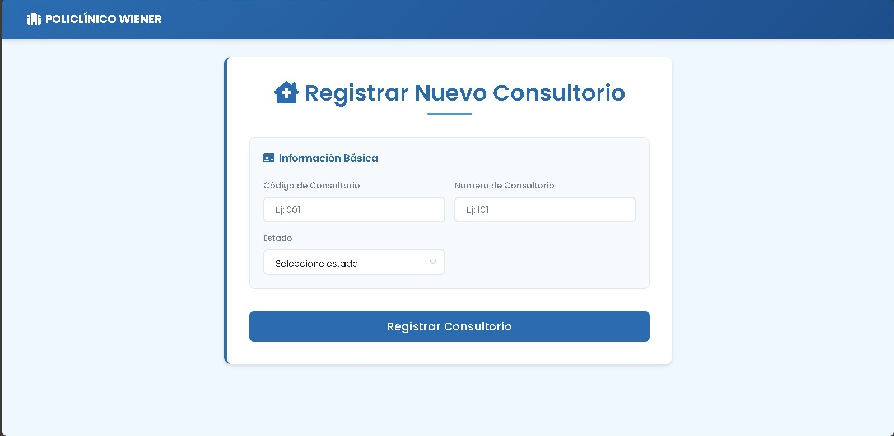
  

  

  

  

    <h2 align="center">Proyecto Redes e Internet: Policlínico</h2>
    
<em>Conexion a internet conun router y asi mismo conexion a las carpetas especificas por departamento del servidor</em>

    
  

    <!-- 🏨 PROYECTO DE RESERVA DE HOTEL -->

  <h2 align="center">🏨 Proyecto Web: Pagina Web de una Tienda de Perfumes</h2>
  
<em>Proyecto básico realizado en mis primeros pasos como desarrollador web. Permite simular la comra e-comerce de una perfumeria.</em>

  <h3>📋 Descripción general</h3>
  
El sistema fue desarrollado de forma sencilla como parte de mi aprendizaje inicial. Incluye un formulario de compra, asi como la muestra de catalagos(PDF) y confirmación básica.

  <h3>📷 Capturas del sistema:</h3>
  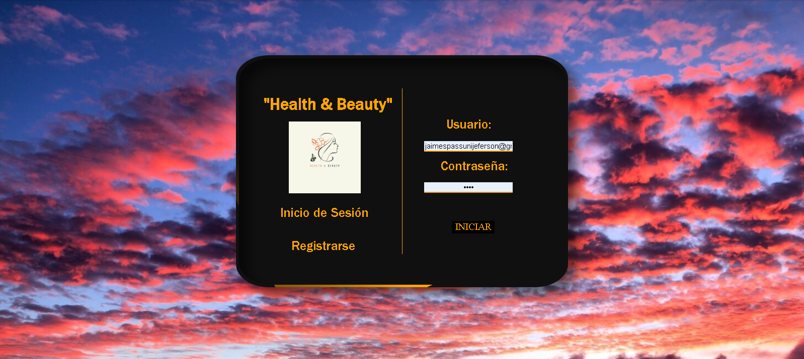
  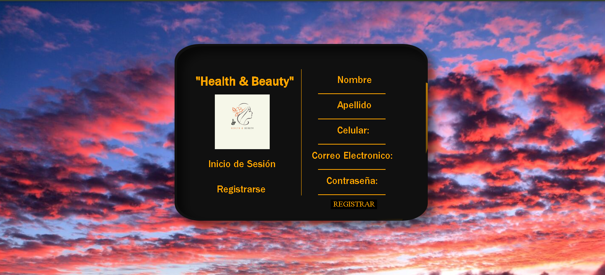
  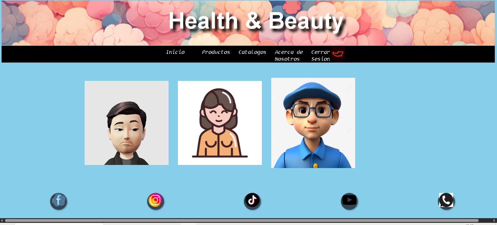
  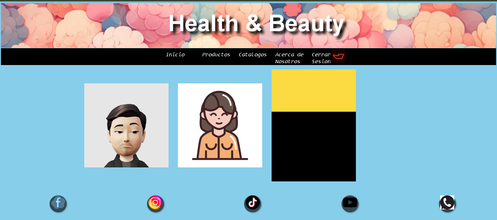
  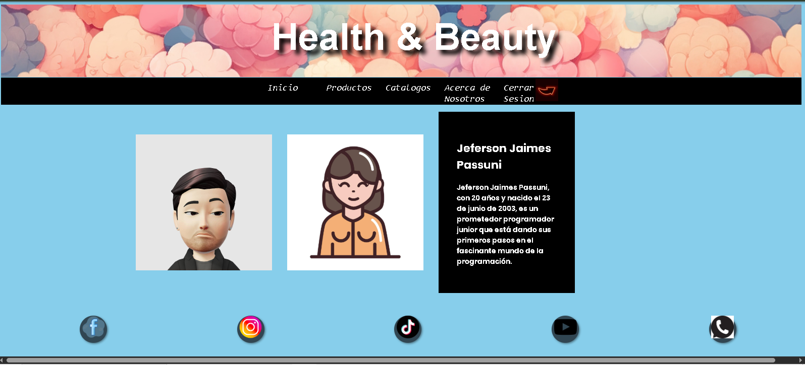

  <h1>📺 Videos en YouTube</h1>
  <table style="margin: 0 auto; border-collapse: collapse;">
    <tbody>
      <tr>
        <td style="padding: 15px; text-align:center; border: 1px solid #ddd; width: 220px;">
          <h3>🔥 Cómo Crear un USB Booteable de Windows 10 con Rufus</h3>
          
           
          <a href="https://youtu.be/OSBODQW9iyI?si=pn4fMnzlJsOJJMf2" target="_blank" style="display:inline-block; margin-top: 10px; padding: 8px 15px; background-color: #FF0000; color: white; text-decoration:none; border-radius:5px; font-weight:bold;">Ver Video</a>
        </td>
       <td style="padding: 15px; text-align:center; border: 1px solid #ddd; width: 220px;">
        <h3>💻 Cómo Aumentar la RAM de tu Laptop</h3>
        
         
        <a href="https://youtu.be/a4b6PMMtDQw?si=fLpNR6JNkhfV9UrU" target="_blank" style="display:inline-block; margin-top: 10px; padding: 8px 15px; background-color: #FF0000; color: white; text-decoration:none; border-radius:5px; font-weight:bold;">Ver Video</a>
      </td>
      <td style="padding: 15px; text-align:center; border: 1px solid #ddd; width: 220px;">
        <h3>🔧 Cómo RESTABLECER una USB después de hacerla Booteable</h3>
        
         
        <a href="https://youtu.be/ba9O6UUS2KU?si=5pDlnn5-JtOgvHjh" target="_blank" style="display:inline-block; margin-top: 10px; padding: 8px 15px; background-color: #FF0000; color: white; text-decoration:none; border-radius:5px; font-weight:bold;">Ver Video</a>
      </td>
    </tr>
    <tr>
      <td style="padding: 15px; text-align:center; border: 1px solid #ddd; width: 220px;">
        <h3>✅ ¡SOLUCIÓN DEFINITIVA! No Puedo Escribir en el Buscador de Windows 10</h3>
        
         
        <a href="https://youtu.be/3BOjZgqjzjI?si=jqq6I6ET9zhhBSYD" target="_blank" style="display:inline-block; margin-top: 10px; padding: 8px 15px; background-color: #FF0000; color: white; text-decoration:none; border-radius:5px; font-weight:bold;">Ver Video</a>
      </td>
      <td style="padding: 15px; text-align:center; border: 1px solid #ddd; width: 220px;">
        <h3>💾 Mostrar Base de Datos en MySQL | SHOW DATABASE</h3>
        
         
        <a href="https://youtu.be/89J5vamDVTk?si=BVGYfuRdxGGXZA9h" target="_blank" style="display:inline-block; margin-top: 10px; padding: 8px 15px; background-color: #FF0000; color: white; text-decoration:none; border-radius:5px; font-weight:bold;">Ver Video</a>
      </td>
      <td style="padding: 15px; text-align:center; border: 1px solid #ddd; width: 220px;">
        <h3>☕✅ Cómo Hacer una Conexión de Base de Datos (Java a MySQL)</h3>
        
         
        <a href="https://youtu.be/RE5Zu2Dg1pE?si=F_axiJ3WJpPz-WuP" target="_blank" style="display:inline-block; margin-top: 10px; padding: 8px 15px; background-color: #FF0000; color: white; text-decoration:none; border-radius:5px; font-weight:bold;">Ver Video</a>
      </td>
    </tr>
  </tbody>
  </table>

<!-- 🔷 SECCIÓN DE ESTADÍSTICAS -->

  <h1>📊 Mis estadísticas</h1>

  <!-- Estadísticas generales -->
  

  <!-- Racha de contribuciones -->
  
   

  

  
 

  <!-- Lenguajes más usados -->
  
  <!-- Snake de contribuciones -->
  <h3>🐍 Snake Eating Contributions in the Last Year</h3>
  

